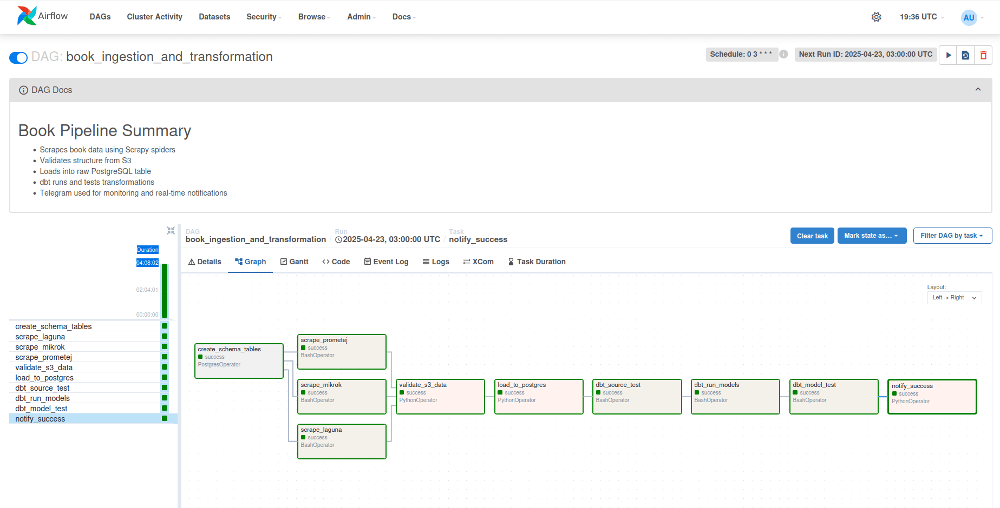
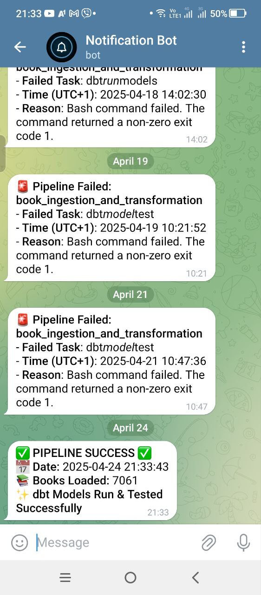

# Cloud Book Price Tracker ELT Pipeline

## Overview

This project implements a complete end-to-end ELT (Extract, Load, Transform) data pipeline designed to scrape book data (including prices, metadata, etc.) from multiple Serbian online bookstores/publishers, store it, transform it into an analysis-ready format, and orchestrate the entire process. The pipeline leverages modern data engineering tools and cloud infrastructure, running daily to capture price changes over time.

The primary goal is to build a robust, automated system demonstrating skills in data ingestion, cloud storage, data warehousing, data transformation, testing, and orchestration – suitable for a data engineering portfolio.

## Architecture

The pipeline follows an ELT approach orchestrated by Airflow and containerized using Docker, deployed on AWS cloud infrastructure:

1.  **Extract:** Scrapy spiders (running within Docker on EC2, triggered by Airflow) scrape data daily from configured publisher websites.
2.  **Load (Landing):** Raw scraped data (CSV) is uploaded to an **AWS S3** bucket for raw data storage (Data Lake landing zone).
3.  **Load (Raw DWH):** An Airflow task copies the raw data from S3 into a `raw` schema in a **PostgreSQL** database (hosted on **AWS RDS**). Basic validation occurs before loading.
4.  **Transform & Test (dbt):** Airflow triggers **dbt** tasks (running within Docker on EC2):
    * `dbt test` runs on the raw source data for initial quality checks.
    * If source tests pass, `dbt run` executes models to clean, standardize, and transform the raw data into staging, intermediate, and finally, analysis-ready mart tables (Star Schema) within the PostgreSQL DWH.
    * `dbt test` runs again on the transformed models to ensure data integrity, consistency, and validity.
5.  **Orchestration & Monitoring:** **Apache Airflow** (running via Docker on EC2) manages the entire workflow scheduling (daily runs), task dependencies, retries, and logging.
6.  **Notifications:** A **Telegram Bot** (running via Docker on EC2, triggered by Airflow) sends real-time notifications on pipeline success or failure.

**Architecture Diagram:**


## Technology Stack

* **Cloud Provider:** AWS (Amazon Web Services)
* **Infrastructure:** EC2 (Compute), RDS (PostgreSQL Database), S3 (Storage)
* **Containerization:** Docker, Docker Compose
* **Orchestration:** Apache Airflow
* **Data Ingestion:** Python, Scrapy
* **Data Transformation/Modeling:** dbt (Data Build Tool)
* **Data Warehouse:** PostgreSQL (on AWS RDS)
* **Programming Languages:** Python, SQL
* **Notifications:** Telegram API
* **Version Control:** Git, GitHub

## Key Features

* **Automated Daily Scrapes:** Pipeline runs automatically every night.
* **Cloud-Native:** Leverages scalable and managed AWS services (S3, RDS, EC2).
* **ELT Approach:** Raw data loaded first, transformations handled efficiently in the warehouse by dbt.
* **Dimensional Data Model:** Data modeled into a Star Schema (Fact & Dimensions) for easy analytics.
* **Data Quality:** Automated data tests using dbt (generic and singular tests) at source and model levels.
* **Incremental Loading:** Fact table (`fct_book_prices`) uses an incremental materialization strategy for efficiency.
* **Robust Orchestration:** Airflow manages scheduling, dependencies, retries, and logging.
* **Containerized Deployment:** Docker ensures consistent environments.
* **Real-time Monitoring:** Telegram alerts for pipeline status.
* **Modular dbt Project:** Clear separation between staging, intermediate, and mart layers.

## Data Model (Star Schema)

The final data model resides in the data warehouse (PostgreSQL on RDS) within the `dbt_prod` schema (or similar, defined by dbt target). It follows a Star Schema optimized for analyzing book prices and attributes over time.

**ER Diagram:**

```mermaid
erDiagram
    %% We define tables and their main columns
    %% PK = Primary Key, FK = Foreign Key

    dim_date {
        int date_id PK
        date full_date
        int day_of_month
        int month_of_year
        int year
        int quarter_of_year
        string day_name
        int day_of_week_iso
        boolean is_weekend
    }

    dim_authors {
        string author_id PK
        string author_name "Includes '(Unknown Author)'"
    }

    dim_publishers {
        string publisher_id PK
        string publisher_name "Can include 'Unknown'"
    }

    dim_books {
        int book_id PK "Natural Key from Source"
        string publisher_id FK "Ref: dim_publishers"
        string title
        string category "Can be NULL"
        string isbn "Hyphen-less or NULL"
        string script_type "'Latin', 'Cyrillic', or NULL"
        int page_numbers "Can be NULL"
        int year_of_publication "Can be NULL"
        timestamp last_scraped_at "Timestamp from stg_books"
        timestamp dbt_last_processed_at "Timestamp from stg_books updated_at"
    }

    brg_book_author {
        int book_id PK, FK "Ref: dim_books"
        string author_id PK, FK "Ref: dim_authors"
    }

    fct_book_prices {
        string book_price_daily_pk PK "Surrogate PK (book+date)"
        int book_id FK "Ref: dim_books"
        int date_id FK "Ref: dim_date"
        string publisher_id FK "Ref: dim_publishers"
        string currency "'RSD'"
        numeric old_price "Can be NULL"
        numeric discount_price "Can't be NULL"
        timestamp max_scraped_at "Watermark for incremental load"
    }

    %% We define connections (Relationships)
    fct_book_prices ||--o{ dim_date : FK_date_id
    fct_book_prices ||--o{ dim_books : FK_book_id
    fct_book_prices ||--o{ dim_publishers : FK_publisher_id

    dim_books ||--o{ dim_publishers : FK_publisher_id

    dim_books ||--|{ brg_book_author : book_has_author
    dim_authors ||--|{ brg_book_author : author_has_book
```

## Project Structure
```
   .
├── airflow
│   └── dags
│       └── book_pipeline.py
├── booksscraper
│   ├── __init__.py
│   ├── items.py
│   ├── middlewares.py
│   ├── pipelines.py
│   ├── scraping_stats.py
│   ├── settings.py
│   └── spiders
│       ├── __init__.py
│       ├── publisher1_spider.py
│       ├── publisher2_spider.py
│       └── publisher3_spider.py
├── docker-compose.yml
├── Dockerfile
├── README.md
├── requirements.txt
├── scrapy.cfg
├── screenshots
│   └── architecture_diagram.png
├── SETUP_GUIDE.md
└── spider_dbt
    ├── analyses
    │   ├── avg_price_per_publisher.sql
    │   ├── newly_added_books.sql
    │   └── price_change_last_month.sql
    ├── dbt_project.yml
    ├── models
    │   ├── intermediate
    │   │   ├── int_books_metadata.sql
    │   │   └── schema.yml
    │   ├── marts
    │   │   ├── brg
    │   │   │   ├── brg_book_author.sql
    │   │   │   └── schema.yml
    │   │   ├── dim
    │   │   │   ├── dim_authors.sql
    │   │   │   ├── dim_books.sql
    │   │   │   ├── dim_date.sql
    │   │   │   ├── dim_publishers.sql
    │   │   │   └── schema.yml
    │   │   └── fct
    │   │       ├── fct_book_prices.sql
    │   │       └── schema.yml
    │   └── staging
    │       ├── schema.yml
    │       ├── sources.yml
    │       └── stg_books.sql
    ├── packages.yml
    ├── profiles.yml
    └── tests
        ├── marts
        │   ├── dim_authors_without_books.sql
        │   ├── dim_books_without_authors.sql
        │   ├── dim_books_without_prices.sql
        │   ├── dim_date_coverage.sql
        │   ├── dim_date_future_limit.sql
        │   ├── dim_date_invalid_weekend_flag.sql
        │   ├── dim_publishers_without_books.sql
        │   └── fct_book_prices_sanity_checks.sql
        └── stg
            ├── stg_books_completeness.sql
            ├── stg_books_future_publication_years.sql
            ├── stg_books_invalid_book_link_format.sql
            ├── stg_books_invalid_isbn.sql
            ├── stg_books_invalid_page_numbers.sql
            ├── stg_books_price_consistency.sql
            └── stg_books_price_outliers.sql
```

## Setup and Installation

Detailed instructions for setting up the necessary AWS infrastructure (S3, RDS, EC2), configuring connections, and running the pipeline can be found in the dedicated [**SETUP_GUIDE.md**](SETUP_GUIDE.md) file.

A brief overview of prerequisites includes Git, Docker, Docker Compose, and an AWS account.

### Airflow DAG Orchestration

The entire ELT process is orchestrated by the `book_ingestion_and_transformation` DAG in Apache Airflow:

 

### Monitoring

Real-time notifications are sent via Telegram for pipeline success or failure:



<!-- ### Sample Data Output

Example rows from the final `fct_book_prices` table:

 -->

## Data Characteristics & Notes

* **Publisher Specializations:** The scraped data comes from publishers with distinct profiles:
    * One publisher primarily focuses on **IT, computer science, and programming books.**
    * Another is known for publishing **international bestsellers and collaborating with prominent domestic (Serbian) authors.**
    * The third publisher specializes in **literature, historiography, philosophy, and educational books**, often featuring serious, intellectual works with patriotic and educational themes.
* **Mixed Alphabets:** Source data contains a mix of **Serbian Cyrillic and Latin scripts**, reflecting the dual alphabet usage in Serbia. The pipeline includes logic (`script_type` column in `stg_books` and `dim_books`) to attempt identification of the script used in book descriptions.
* **Data Quality:** Expect variations in data completeness from source websites. Fields like ISBN, page numbers, year of publication, author (for non-book items like board games), and category may occasionally be missing. The pipeline uses placeholders (`(Unknown Author)`) or allows `NULL` values for these optional fields, accompanied by relevant dbt tests to monitor data quality.


